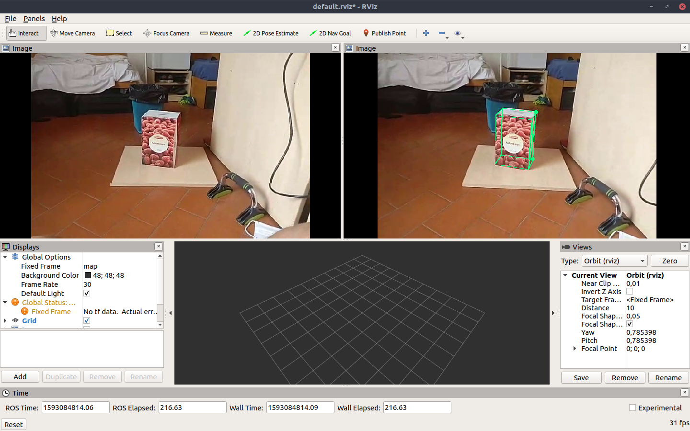

[](https://creativecommons.org/licenses/by-nc-sa/4.0/legalcode)

# Practical Guidelines 
This project is a slightly modified version of NVidia DOPE neural network used as final project for the Robot Control course.


Besides the original readme I will add some practical guidelines useful to set the system up from 3D object reconstruction all the to inference.

The system consists in three main blocks and needs for a convenient implementation both Ubuntu and Windows.
Namely the blocks are:
* Texture mapping (Windows)
* Synthetic Dataset Creation (Windows)
* Network Training (Ubuntu)


## Texture mapping
Thanks to the simple geometries of the objects analysed we simply mapped the undistorted texture photos on 3D models obtained using blender.
More general stereo reconstruction methods were analysed and deployed but resulted in poorer performance for our task.

## Synthetic Dataset Creation
In order to create the dataset you'll need to download Unreal Engine and setup the NDDS plugin.
Unreal Engine is available for both Linux and Windows distribution but we found a lot more convenient its installation on Windows.

First install Visual Studio 2017 version 15.9 from [here](https://visualstudio.microsoft.com/it/vs/community/) and perform a CUSTOM INSTALL. Make sure the following are selected:
* Desktop development with C++
* Latest Windows 10 SDK

To install Unreal Engine you'll first need [Epic Games Laucher](https://visualstudio.microsoft.com/it/vs/community/) and an Epic Games account.

Once installed start the Launcher, login with your account and go to the Unreal Engine tab on the upper left corner of the Launcher. From here, make sure you have Library highlighted and then click the "+" icon as shown below


With the engine installed start the Editor by pressing the Launch button. You will need to start the Editor at least once so that it sets file associations. Creating a blank default project is good enough.


To setup NDDS you first need Git Large File Storage from [here](https://help.github.com/en/github/managing-large-files/installing-git-large-file-storage) and then you can download NDDS using git lfs clone `https://github.com/NVIDIA/Dataset\_Synthesizer.git`.
Launch the plugin using the file `$NDDS/source/NDDS.uproject` nd select "Yes" when it prompts you to rebuild binaries. The compilation will occur behind the scene and open the project when completed.
Guidelines for NDDS usage can be found in `$NDDS/Documentation/NDDS.pdf`

## Network training
Network training due to network dimensions is computationally demanding and you'll need a Nvidia GPU in order to train DOPE locally (8GB+ GPU memory recommended).
The fastest way to set it up locally is by using the [Docker image](https://github.com/NVlabs/Deep_Object_Pose/blob/master/docker/readme.md).

For network training the best option is to use Google Colaboratory GPUs and train the network there. In order to do so you should first upload the dataset as a zip file in Google Drive together with the `train.py`  in `./scripts/train.py`.
First thing to do in Colab is select the GPU runtime by going in 'Runtime' at the top left then 'Change runtime type' and select GPU.
You can use both python and bash commands (for bash start the command with '!'). Check GPU selection by using:
```
!nvidia-smi
```

Then mount Google Drive, all your storage in the cloud will become accessible at specified path in my case `/content/drive`
```python
from google.colab import drive
drive.mount('/content/drive')
```
Unzip your dataset using bash command `unzip $PATH_TO_ZIP_DATASET $DESTINATION_PATH` in my case:
```
!unzip /content/drive/My\ Drive/Colab\ Notebooks/DOPE/NVCapturedData.zip -d ./dataset/
```

Then train the network using `train.py` with optional arguments arguments:
```
  --data DATA           path to training data
  --datatest DATATEST   path to data testing set
  --object OBJECT       In the dataset which objet of interest
  --workers WORKERS     number of data loading workers
  --batchsize BATCHSIZE
                        input batch size
  --imagesize IMAGESIZE
                        the height / width of the input image to network
  --lr LR               learning rate, default=0.001
  --noise NOISE         gaussian noise added to the image
  --net NET             path to net (to continue training)
  --namefile NAMEFILE   name to put on the file of the save weights
  --manualseed MANUALSEED
                        manual seed
  --epochs EPOCHS       number of epochs to train
  --loginterval LOGINTERVAL
  --gpuids GPUIDS [GPUIDS ...]
                        GPUs to use
  --outf OUTF           folder to output images and model checkpoints, it will
                        add a train_ in front of the name
  --sigma SIGMA         keypoint creation size for sigma
  --save                save a visual batch and quit, this is for debugging
                        purposes
  --pretrained PRETRAINED
                        do you want to use vgg imagenet pretrained weights
  --nbupdates NBUPDATES
                        nb max update to network, overwrites the epoch number
                        otherwise uses the number of epochs
  --datasize DATASIZE   randomly sample that number of entries in the dataset
                        folder
  --option OPTION
```
In this case, if starting training without pretrained weights:
```
!python3 /content/drive/My\ Drive/Colab\ Notebooks/DOPE/original/train.py --data /content/dataset/ --outf hallonspona --gpuids 0 --epochs 5 --batchsize 24 --lr 0.001
```

With pretrained weights:

```
!python3 /content/drive/My\ Drive/Colab\ Notebooks/DOPE/original/train.py \\ --data /content/dataset/ --net /content/drive/My\ Drive/Colab\ Notebooks/DOPE/net_epoch_5.pth --outf hallonspona --gpuids 0 --pretrained True --epochs 5 --batchsize 24 --lr 0.0002
```

In particular batch size was set as high as possible compatibly with GPU memory (around 2x GPU memory in GB), and the number of epochs was set to 5 in order to backup on drive the weights every 5 epochs using:
```
!cp /content/train_hallonspona/net_epoch_5.pth /content/drive/My\ Drive/Colab\ Notebooks/DOPE
```

Access to GPU runtime is indeed limited and it may occur that notebook execution is suddenly interrupted (usually after 8+ hours but almost randomly). In that case is better to have partial backups as training goes on.
Training is monitored by checking loss on training set and belief maps representation.

## Run the Trained Net

Running inference on images from camera is explained well below, the main things you need to do in order to use the net 
on costum objects are:
* Calibrate your camera by modifying `./config/camera_info.yaml`
* Associate your trained weights with your object by modifying  `./config/config_pose.yaml.`

RVIZ can then be used to display inference results in realtime, after launching it the two image topics should be added 
by clicking add in the bottom left and selecting topics `"/dope/webcam/image_raw"` and `"dope/rgb_points/image_raw"`



# Deep Object Pose Estimation - ROS Inference

This is the official DOPE ROS package for detection and 6-DoF pose estimation of **known objects** from an RGB camera.  The network has been trained on the following YCB objects:  cracker box, sugar box, tomato soup can, mustard bottle, potted meat can, and gelatin box.  For more details, see our [CoRL 2018 paper](https://arxiv.org/abs/1809.10790) and [video](https://youtu.be/yVGViBqWtBI).

*Note:*  The instructions below refer to inference only.  Training code is also provided but not supported.


## Update 
16/03/2020 - Added a wiki (thanks to [@saratrajput](https://github.com/saratrajput)) 

03/07/2019 - ROS interface update (thanks to Martin Günther)

11/06/2019 - Added bleach YCB weights 

## Installing

We have tested on Ubuntu 16.04 with ROS Kinetic with an NVIDIA Titan X with python 2.7.  The code may work on other systems.

The following steps describe the native installation. Alternatively, use the provided [Docker image](docker/readme.md) and skip to Step #7.

1. **Install ROS**

    Follow these [instructions](http://wiki.ros.org/kinetic/Installation/Ubuntu).
    You can select any of the default configurations in step 1.4; even the
    ROS-Base (Bare Bones) package (`ros-kinetic-ros-base`) is enough.

2. **Create a catkin workspace** (if you do not already have one). To create a catkin workspace, follow these [instructions](http://wiki.ros.org/catkin/Tutorials/create_a_workspace):
    ```
    $ mkdir -p ~/catkin_ws/src   # Replace `catkin_ws` with the name of your workspace
    $ cd ~/catkin_ws/
    $ catkin_make
    ```

3. **Download the DOPE code**
    ```
    $ cd ~/catkin_ws/src
    $ git clone https://github.com/NVlabs/Deep_Object_Pose.git dope
    ```

4. **Install python dependencies**
    ```
    $ cd ~/catkin_ws/src/dope
    $ pip install -r requirements.txt
    ```

5. **Install ROS dependencies**
    ```
    $ cd ~/catkin_ws
    $ rosdep install --from-paths src -i --rosdistro kinetic
    $ sudo apt-get install ros-kinetic-rosbash ros-kinetic-ros-comm
    ```

6. **Build**
    ```
    $ cd ~/catkin_ws
    $ catkin_make
    ```

7. **Download [the weights](https://drive.google.com/open?id=1DfoA3m_Bm0fW8tOWXGVxi4ETlLEAgmcg)** and save them to the `weights` folder, *i.e.*, `~/catkin_ws/src/dope/weights/`.


## Running

1. **Start ROS master**
    ```
    $ cd ~/catkin_ws
    $ source devel/setup.bash
    $ roscore
    ```

2. **Start camera node** (or start your own camera node)
    ```
    $ roslaunch dope camera.launch  # Publishes RGB images to `/dope/webcam_rgb_raw`
    ```

    The camera must publish a correct `camera_info` topic to enable DOPE to compute the correct poses. Basically all ROS drivers have a `camera_info_url` parameter where you can set the calibration info (but most ROS drivers include a reasonable default).

    For details on calibration and rectification of your camera see the [camera tutorial](doc/camera_tutorial.md).

3. **Edit config info** (if desired) in `~/catkin_ws/src/dope/config/config_pose.yaml`
    * `topic_camera`: RGB topic to listen to
    * `topic_camera_info`: camera info topic to listen to
    * `topic_publishing`: topic namespace for publishing
    * `input_is_rectified`: Whether the input images are rectified. It is strongly suggested to use a rectified input topic.
    * `downscale_height`: If the input image is larger than this, scale it down to this pixel height. Very large input images eat up all the GPU memory and slow down inference. Also, DOPE works best when the object size (in pixels) has appeared in the training data (which is downscaled to 400 px). For these reasons, downscaling large input images to something reasonable (e.g., 400-500 px) improves memory consumption, inference speed *and* recognition results.
    * `weights`: dictionary of object names and there weights path name, **comment out any line to disable detection/estimation of that object**
    * `dimensions`: dictionary of dimensions for the objects  (key values must match the `weights` names)
    * `class_ids`: dictionary of class ids to be used in the messages published on the `/dope/detected_objects` topic (key values must match the `weights` names)
    * `draw_colors`: dictionary of object colors (key values must match the `weights` names)
    * `model_transforms`: dictionary of transforms that are applied to the pose before publishing (key values must match the `weights` names)
    * `meshes`: dictionary of mesh filenames for visualization (key values must match the `weights` names)
    * `mesh_scales`: dictionary of scaling factors for the visualization meshes (key values must match the `weights` names)
    * `thresh_angle`: undocumented
    * `thresh_map`: undocumented
    * `sigma`: undocumented
    * `thresh_points`: Thresholding the confidence for object detection; increase this value if you see too many false positives, reduce it if  objects are not detected.

4. **Start DOPE node**
    ```
    $ roslaunch dope dope.launch [config:=/path/to/my_config.yaml]  # Config file is optional; default is `config_pose.yaml`
    ```


## Debugging

* The following ROS topics are published (assuming `topic_publishing == 'dope'`):
    ```
    /dope/webcam_rgb_raw       # RGB images from camera
    /dope/dimension_[obj_name] # dimensions of object
    /dope/pose_[obj_name]      # timestamped pose of object
    /dope/rgb_points           # RGB images with detected cuboids overlaid
    /dope/detected_objects     # vision_msgs/Detection3DArray of all detected objects
    /dope/markers              # RViz visualization markers for all objects
    ```
    *Note:* `[obj_name]` is in {cracker, gelatin, meat, mustard, soup, sugar}

* To debug in RViz, run `rviz`, then add one or more of the following displays:
    * `Add > Image` to view the raw RGB image or the image with cuboids overlaid
    * `Add > Pose` to view the object coordinate frame in 3D.
    * `Add > MarkerArray` to view the cuboids, meshes etc. in 3D.
    * `Add > Camera` to view the RGB Image with the poses and markers from above.

    If you do not have a coordinate frame set up, you can run this static transformation: `rosrun tf2_ros static_transform_publisher 0 0 0 0.7071 0 0 -0.7071 world <camera_frame_id>`, where `<camera_frame_id>` is the `frame_id` of your input camera messages.  Make sure that in RViz's `Global Options`, the `Fixed Frame` is set to `world`. Alternatively, you can skip the `static_transform_publisher` step and directly set the `Fixed Frame` to your `<camera_frame_id>`.

* If `rosrun` does not find the package (`[rospack] Error: package 'dope' not found`), be sure that you called `source devel/setup.bash` as mentioned above.  To find the package, run `rospack find dope`.


## YCB 3D Models

DOPE returns the poses of the objects in the camera coordinate frame.  DOPE uses the aligned YCB models, which can be obtained using [NVDU](https://github.com/NVIDIA/Dataset_Utilities) (see the `nvdu_ycb` command).


## Citation

If you use this tool in a research project, please cite as follows:
```
@inproceedings{tremblay2018corl:dope,
 author = {Jonathan Tremblay and Thang To and Balakumar Sundaralingam and Yu Xiang and Dieter Fox and Stan Birchfield},
 title = {Deep Object Pose Estimation for Semantic Robotic Grasping of Household Objects},
 booktitle = {Conference on Robot Learning (CoRL)},
 url = "https://arxiv.org/abs/1809.10790",
 year = 2018
}
```

## License

Copyright (C) 2018 NVIDIA Corporation. All rights reserved. Licensed under the [CC BY-NC-SA 4.0 license](https://creativecommons.org/licenses/by-nc-sa/4.0/legalcode).


## Acknowledgment

Thanks to Jeffrey Smith (jeffreys@nvidia.com) for creating the Docker image.


## Contact

Jonathan Tremblay (jtremblay@nvidia.com), Stan Birchfield (sbirchfield@nvidia.com)
